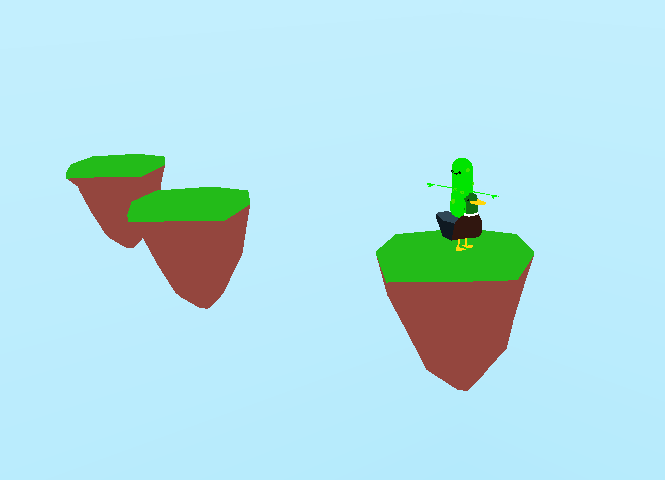

# AS9 - DOECS Custom Game - README

This program is a DOECS architecture custom game. A simple game where a pickle is riding a duck and your goal is to see how many platforms you can jump on!
Why a pickle and a duck? They were free and caught my eye.



### Instructions for Installation

Please follow the steps below to install

### 1. Update System and Install Dependencies

```bash
sudo apt update
sudo apt install xorg-dev
sudo apt install pulseaudio
sudo apt install cmake
```

### 2. Clone the Repository Into Preferred Directory

```bash
git clone https://github.com/masonhaines/CS-381-mason-haines.git
cd CS-381-mason-haines/as9/
```

### 3. Fetch Git Submodules

```bash
git submodule update --init --recursive
```

### 3.5. Additional Setup (Optional)

If you're using Visual Studio Code, please install the following extensions:

- C/C++ for Visual Studio Code
- CMake for Visual Studio Code
- Visual Studio Code C++ Extension Pack

### 4. Build

```bash
mkdir build
cd build
cmake ..
make
```

### 5. Executable

To exit the program/window, press 'X' on the top right of the window, and the program will terminate.

```bash
./as9
```

## 6. Controls and How to Play

  - Press 'W' to go forward

  - Press 'S' to go backwards

  - Press 'A' to turn left 

  - Press 'D' to turn right 

  - Press 'C' to change camera view

  - Press 'Space' to jump

  In the game you can move around as much as you like until you jump on a platform! After that your only option is go up to the next one or lose. 
  Jump on as many platforms as you can. No time restrictions other than going outside eventually. You only have 2 jumps, so use them wisely, eventually you will get three as the platforms get farther away. Pressing 'W' on the keyboard can sped you up a lot so use that to your advantage. Also, make suer to land directly on top of the islands if you dont wanna fall to the ground and lose.

## 7. Extra Credit 

2 additional systems were required and I have three!

void spinSystem(Scene<ComponentStorage>& scene, float dt);
void CameraSystem(Scene<ComponentStorage>& scene, float dt);
void CheckCollisions(Scene<ComponentStorage>& scene, Entity character1);

Grading myself I'd give myself a 102%. All criteria has been met and I have an extra system so 100 + 2 = 102 (engineer can maths).